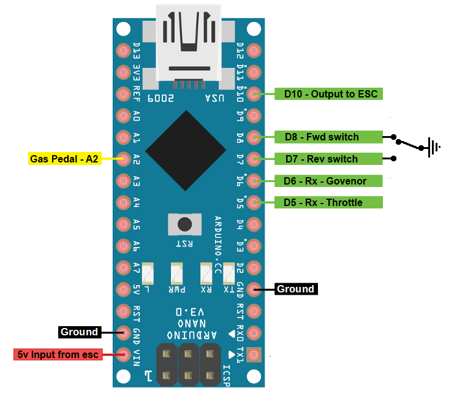

This program is intended to allow 2 inputs and one output for making a remote control power wheels
Input one is a pwm signal from the remote reciever
Input two is variable voltage from a 5v hall sensor pedal. 
  The output from the hall sensor should be around 0-5v

I think my pedal is not great because the voltage range is pretty small.
Output is in the form of a pwm signal that works with RC car speed controllers.
There is a govenor conected to an aux channel that agjust the max speed the pedal will alow.

I use spektrum remotes wich have a signal range of 1100-1900 pwm 
The failsafe for spektrum recievers is 1500 if the remote is not turned on. 
This Sets the Govenor to 50% when the remote is turned off
  The remote off govener speed can be adjused if your esc has a throttle curve.
    Set the 50% mark of the throttle curve to what you want the throttle off govenor to be.

My Forward/Neutral/Reverse switch is 3 position SPDT On-Off-On conected to ground (no power wire goes to the switch!)
